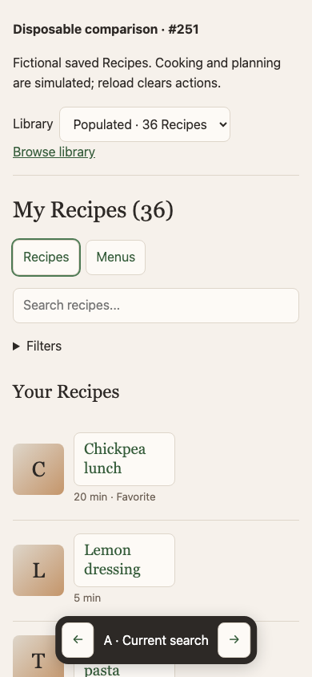
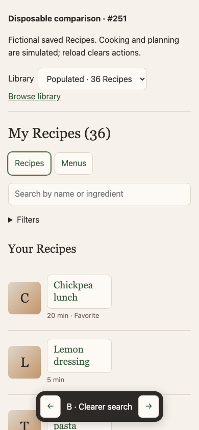
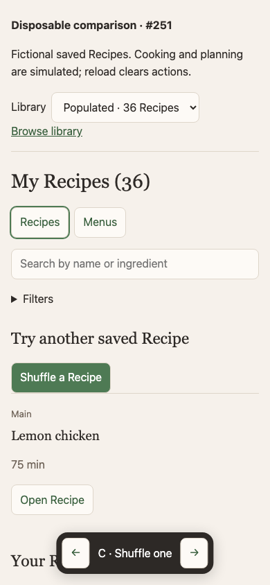
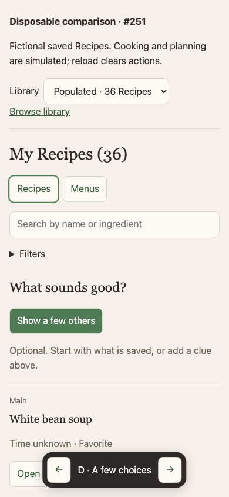
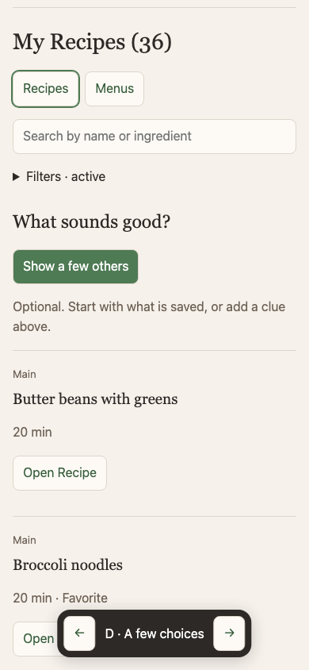
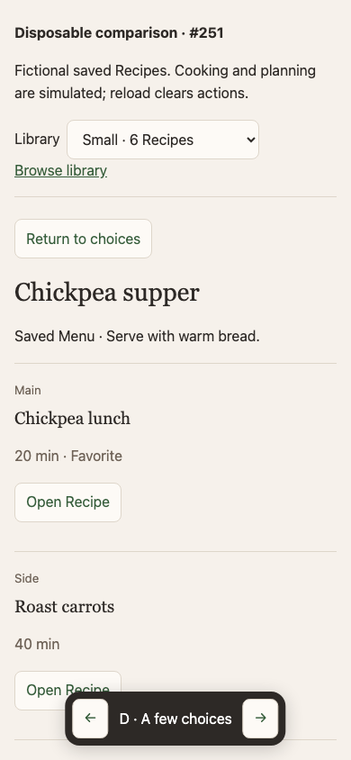
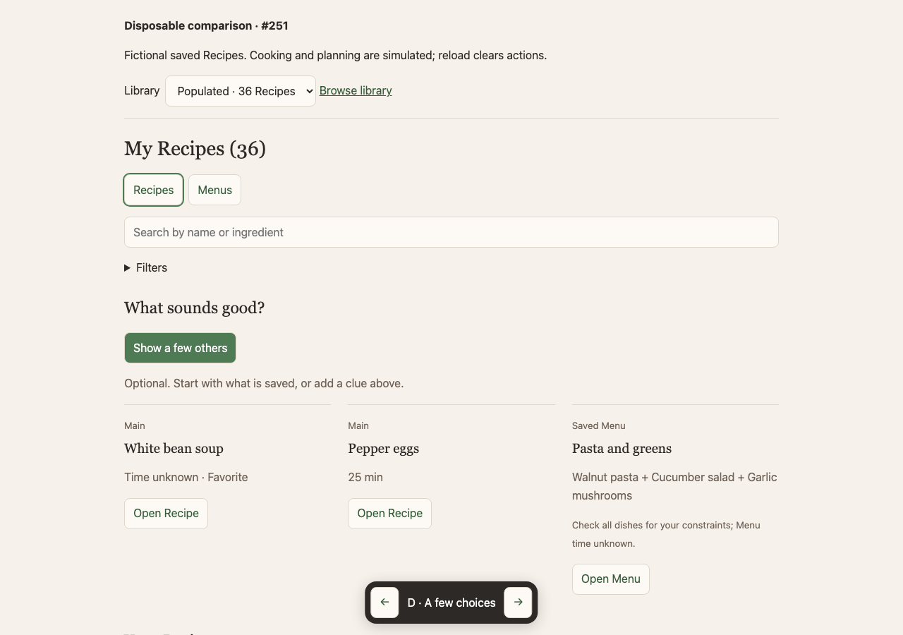

# Saved-Recipe chooser comparison — disposable, decision pending

Related to #251 and #249. Do not merge this branch or treat the prototype as an
accepted feature. Application routes, data, and dependencies are unchanged.

Run from this branch: `bun docs/experiments/251/run.ts`, then open
http://127.0.0.1:9251/?variant=A. No keys or database needed. Stop with Ctrl-C.
The bottom arrows switch A–D (also keyboard arrows outside controls). All
actions are in memory and reset on reload. Only the variant is retained in the
URL.

| Variant           | What changes                                                                                                                                    | Expected tradeoff, still unvalidated                                                        |
| ----------------- | ----------------------------------------------------------------------------------------------------------------------------------------------- | ------------------------------------------------------------------------------------------- |
| A: current search | Ordinary full library, current search wording and ingredient/name ranking                                                                       | Fast when a dish or clue is known; ingredient matching is hard to discover                  |
| B: clearer search | “Search by name or ingredient”; same library and matching                                                                                       | Lowest added complexity; still requires a clue                                              |
| C: shuffle one    | Explicit random saved Recipe, full library still below                                                                                          | Small interaction; serial rejections may add effort and a dressing may appear               |
| D: a few choices  | Optional three candidates, favoring existing Main or unclassified Recipes with differing known Cuisine; include an existing Menu where possible | Supports side-by-side discussion; may add reading and reshuffling without a better decision |

**Recommendation for human use:** compare B with D during actual dinner
decisions; retain A and C as controls. Prefer clearer search alone unless D
makes overlooked saved dishes credible choices and reduces effort beyond
novelty. Do not ship D based on this artifact. In small collections it may
simply repeat the visible library. A history/ranking system is not justified by
this comparison.

The 6- and 36-Recipe fictional libraries include unknown time and Course, known
Main/Side/Dressing/Dip values, favorites, and one/two saved Menus. Time filters
keep unknown values eligible. Fixture order represents Recently Updated, never
cooking history. D uses no inventory, AI, logs, or automatic dish pairing. When
only sides/dressings match, they keep their actual Course label. A Menu is an
existing complete arrangement, not proof that all its dishes meet a clue or time
constraint; that limitation appears beside it. The filter applies to candidate
Recipes; Menu candidates contain at least one matching Recipe and require a
whole-Menu check. Assess whether this is confusing before specifying any
feature.

This is a standalone approximation of the library layout, isolated per the
issue, with the production pure search function reused. The static surface uses
system fonts/Georgia, reduced filter controls (time, favorites, Course), and a
flat list at both widths. It omits auth, onboarding, editing, classification
management, Cuisine/Season selectors, sorts, images, and app navigation. A
includes small shared clarity aids (filter indicator, clear-all, unknown time
under constraints), so these are **not** evidence of changes to the exact
shipped UI; #248 owns that separate correction. Cooking/planning are simulated,
not integration validation.

## Review tasks

1. Small library, no clue: compare scanning with shuffle and three candidates.
2. Populated library, “chickpeas” or “lemon”: compare ingredient search and
   choices.
3. Try Favorites plus “walnut”, clear constraints, then Under 30 min: unknown
   time remains unknown. Try Course Dressing: a component is not relabelled
   dinner.
4. Open a Recipe, cook directly with check-off, or optionally pick a Plan date.
5. Open Chickpea supper, inspect each dish and its note, then open a dish to
   cook or plan the saved Menu. No Plan is required for cooking.
6. Try a nonexistent clue and recover to the ordinary library. Switch sizes and
   variants, including at phone width and using the keyboard.

## Evidence and decision boundary

Local Chromium checks at 390×844 and 1280×900 exercised all four variants, both
library sizes, no-result/time filters, direct cooking, Recipe planning and Menu
opening. Screens below are durable visual evidence. A Menu rendering error found
during review was fixed and the journey rerun. No production or interview data
was used. No automated test suite is added to disposable prototype code.

The artifact establishes that the bounded interaction can be represented using
existing data, and exposes tradeoffs around component dishes, unknown metadata,
Menu scope, and repeated samples. It does not establish less effort, recurring
value, an overlooked/wanted dish, actual cooking, or prospective-user benefit.

During real dinner choices, record privately with participating household
members: which option they used, candidates accepted/rejected and why, effort to
decide, reshuffles/fallbacks, and whether the dish was cooked. Include
prospective users' smaller libraries where feasible. Publish only concise
non-private findings. No quota or fixed study duration is required. Decide on
#251: clearer search only, a bounded chooser with separately specified scope,
revise, or stop. Leave #251 open and ready-for-human until that decision. #252
stays the next experiment; #224 proceeds independently while feedback is
pending.

## Screens

| A: ordinary search              | B: clearer search               |
| ------------------------------- | ------------------------------- |
|  |  |

| C: shuffle                      | D: a few candidates             |
| ------------------------------- | ------------------------------- |
|  |  |

